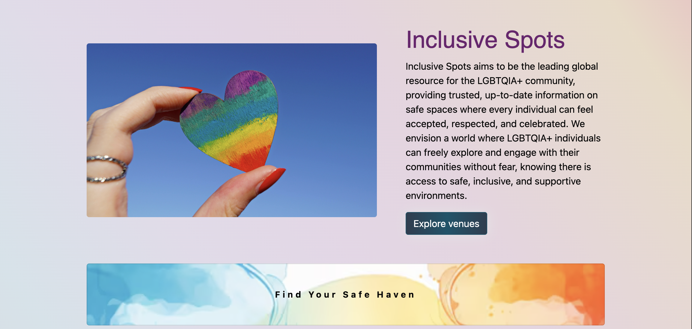
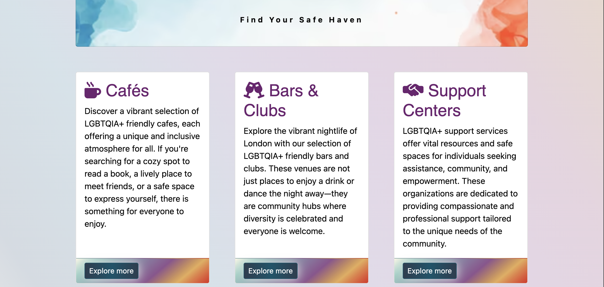
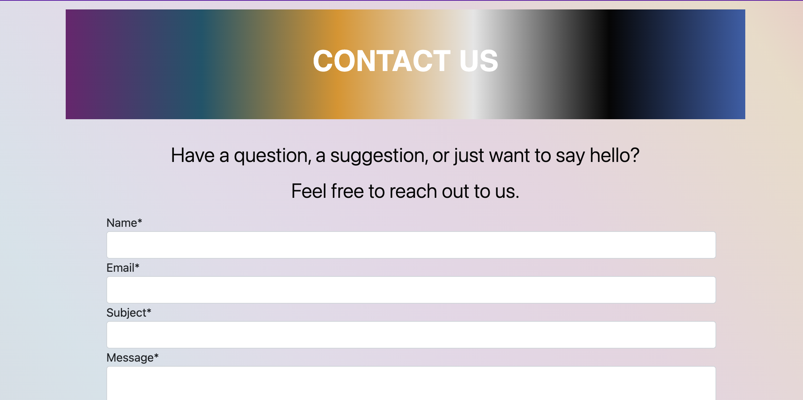
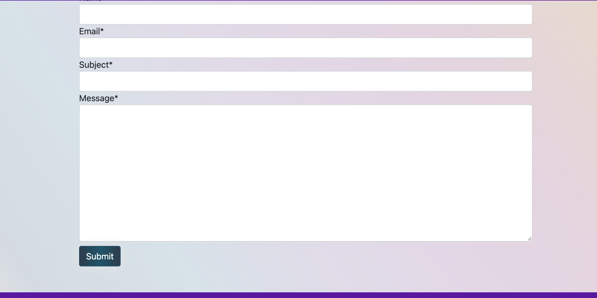
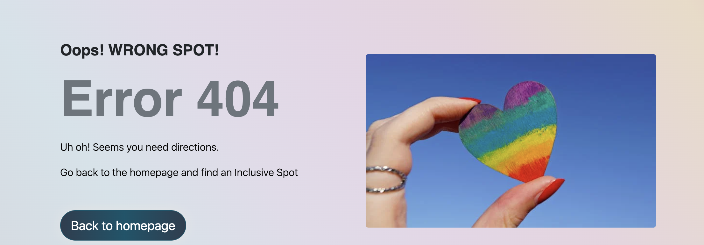
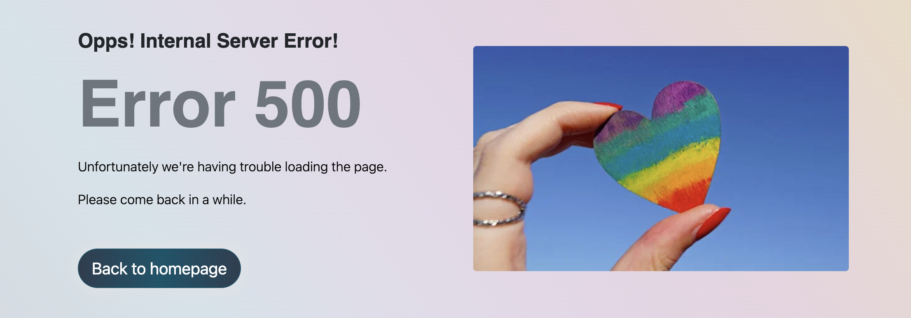

  <h1 align="center"><strong> 🏳️‍🌈🏳️‍🌈🏳️‍🌈 PRIDEFUL PROGRAMMERS 🏳️‍🌈🏳️‍🌈🏳️‍🌈 </strong></h1>
  <h3 align="center"> - Safe spaces for the LGBTQIA+ community -</h3>
  
 This project was made as an entry to <strong>Proud Coders</strong>-Hackathon, July 2024 organized by  

   
  

The project is deployed and can be accessed at [https://prideful-programmers-01c026806d6f.herokuapp.com/](https://prideful-programmers-01c026806d6f.herokuapp.com/)

## Table of Contents

1. [Introduction](#introduction)
2. [Criteria](#criteria)
3. [Project Goals](#project-goals)
    1. [Problem Statement](#problem-statement)
    2. [Objectives](#objectives)
    3. [Target Audience](#target-audience)
    4. [Benefits](#benefits)
4. [Database Scheme](#database-scheme)
    1. [Home App](#home-app)
    2. [Venues App](#venues-app)
5. [Design](#design)
    1. [Design Choices](#design-choices)
    2. [Colour](#colour)
    3. [Fonts](#fonts)
    4. [Structure](#structure)
    5. [Wireframes](#wireframes)
6. [Technologies Used](#technologies-used)
    1. [Languages](#languages)
    2. [Frameworks](#frameworks)
    3. [Database](#database)
    4. [Tools](#tools)
    5. [Supporting Libraries and Packages](#supporting-libraries-and-packages)
7. [Methodology](#methodology)
8. [Features](#features)
9. [Future Features](#future-features)
10. [Deployment](#deployment)
11. [Performance](#performance)
12. [Code Validation](#html-validation)
    1. [HTML Validation](#html-validation)
    2. [CSS Validation](#css-validation)
13. [Credits](#credits)
14. [Acknowledgements](#acknowledgements)

## Introduction
Welcome to Inclusive Spots directory! This project aims to provide a comprehensive, user-friendly platform dedicated to helping the LGBTQIA+ community find and share safe spaces. Whether you're looking for a welcoming cafe, a supportive community center, or an inclusive club, our directory is designed to help you find places where you can feel safe, accepted, and celebrated. The directory is built with the mission of fostering a supportive and inclusive environment for the LGBTQIA+ community. In many places around the world, finding safe and accepting spaces can be challenging. Our platform seeks to bridge this gap by offering a reliable resource where community members can discover, review, and share information about spaces that are welcoming and supportive.

This directory includes a variety of spaces such as cafes, clubs, support centers, and more. Users can view detailed information about each space, read and write reviews. By empowering users to share their experiences and knowledge, we aim to create a vibrant, supportive network that enhances the well-being and connectedness of the LGBTQIA+ community.

[Return to Table of Contents](#table-of-contents)

## Criteria

To ensure that Inclusive Spots directory project meets its goals effectively, we focus on the following criteria to guide our efforts to create a meaningful, practical, and forward-thinking platform that addresses the needs of the LGBTQIA+ community.

- <strong>Demonstrates an Impact on the LGBTQIA+ Community:</strong> To address the need for safe and inclusive environments, reducing the stress and fear associated with finding accepting places. By enabling users to share their experiences and provide feedback, the platform promotes community engagement and support. The directory helps create visibility for welcoming spaces, encouraging more businesses and organizations to adopt inclusive practices. Overall, the project fosters a sense of belonging and safety within the LGBTQIA+ community.

- <strong>Realistic and Has Real World Value:</strong> This project is grounded in real-world needs, as many LGBTQIA+ individuals often face challenges in finding safe and inclusive spaces. Utilizing established technologies like HTML, CSS, JavaScript, Python, and Django ensures that the project is feasible with current resources and skills. The platform’s features, such as location-based searches and user reviews, provide practical, everyday value to users seeking safe spaces. By addressing a clear and present need, the directory offers tangible benefits to its users and the broader community.

- <strong>Demonstrates Innovation and Creativity:</strong> The project introduces a novel approach by combining user-generated content with advanced search and mapping capabilities to create a dynamic, interactive resource. The platform’s focus on accessibility and detailed information about each space showcases a commitment to inclusivity and user-centric design. By leveraging technology to create a supportive community hub, the project demonstrates creativity in addressing social issues through digital innovation. The platform’s unique blend of features and its mission-driven purpose exemplify forward-thinking and imaginative problem-solving.

[Return to Table of Contents](#table-of-contents)

## Project goals

The Inclusive Spots directory aims to address the challenge of locating safe and inclusive spaces for the LGBTQIA+ community. By creating a comprehensive and user-friendly platform, we strive to foster a supportive environment where individuals can easily find, share, and review welcoming places. Our ultimate goal is to enhance the well-being and connectedness of the LGBTQIA+ community by promoting accessible and inclusive spaces.

### Problem Statement
Many LGBTQIA+ individuals struggle to find safe and inclusive spaces where they can feel accepted and supported. This lack of easily accessible information on welcoming places can lead to feelings of isolation and vulnerability.

### Objectives
- Create a comprehensive and user-friendly directory of safe spaces for the LGBTQIA+ community.
- Provide detailed information, reviews, and ratings to help users make informed decisions about where to go.
- Foster a supportive and inclusive online community where users can share their experiences and resources.

### Target Audience
The primary audience includes LGBTQIA+ individuals seeking safe and supportive environments, as well as allies looking to find or recommend inclusive spaces. Secondary audiences are organizations and businesses that wish to promote their inclusive practices.

### Benefits
Users gain easy access to information about safe and welcoming spaces, reducing the stress and uncertainty of finding such places. The platform fosters a sense of community and belonging, encouraging users to support each other through shared experiences and recommendations.

[Return to Table of Contents](#table-of-contents)

## Database Scheme

### Home App
The home app is the entry point of the Inclusive Spots website, designed to provide an overview of the platform's mission and guide users to explore various LGBTQIA+ friendly venues. It aims to introduce users to the mission of the website and provide easy navigation to different venue categories such as Cafés, Bars & Clubs, and Support Centers. The app contains static content that highlights the purpose of the platform and encourages users to explore more. The key features to the home app which also serves as the homepage to the project include;
- <strong>Hero Section:</strong> A welcoming image and a brief description of the platform's mission.
- <strong>Call to Action:</strong> A prominent button that directs users to the venue listing page.
- <strong>Categories Overview:</strong> Cards representing different venue categories (Cafés, Bars & Clubs, Support Centers) with a description and a link to explore more venues.

### Venues App
The venues app is a crucial part of the Inclusive Spots platform, designed to showcase various LGBTQIA+ friendly venues. It provides detailed information about each venue, allowing users to explore and find safe spaces. The app manages and displays a comprehensive list of LGBTQIA+ friendly venues, categorized into different types such as Cafés, Bars & Clubs, and Support Centers. Users can browse through the list of venues, view detailed information about each venue, and explore the specific features of each category. The key features to the venues app include; 
- <strong>Venue Listing:</strong> A list view displaying all venues with basic information and images.
- <strong>Venue Details:</strong> A detail view providing comprehensive information about each venue, including address, contact information, opening hours, special features, and more.
- <strong>Administrative Interface:</strong> Integration with Django's admin interface to manage venues and cities efficiently.

[Return to Table of Contents](#table-of-contents)

## Design

### Design Choices
The design of the Inclusive Spots website is thoughtfully crafted to provide an inviting and user-friendly experience for visitors seeking LGBTQIA+ friendly venues. The website employs a clean and modern aesthetic, utilizing a combination of vibrant imagery and well-organized content to create a welcoming atmosphere. Below are some of the notable design elements for the project. 
- <strong>Responsive Layout:</strong> The website is fully responsive, ensuring a seamless browsing experience across various devices, from desktops to mobile phones. The use of Bootstrap CSS framework helps in maintaining a consistent and adaptive design.
- <strong>Intuitive Navigation:</strong> Navigation is straightforward and intuitive, with a clear menu structure and prominent call-to-action buttons that guide users to explore different sections of the site, such as venue listings and the about page.
- <strong>Visual Appeal:</strong> High-quality images and a cohesive color palette enhance the visual appeal of the site. The homepage features a hero image that immediately engages visitors, accompanied by concise and compelling text about the platform's mission.
- <strong>Category Highlights:</strong> The homepage highlights different venue categories (Cafés, Bars & Clubs, and Support Centers) with distinct cards, each featuring an icon, brief description, and a link to explore more. This design element helps users quickly identify and access the information they are interested in.
- <strong>Custom Error Pages:</strong> Custom 404 and 500 error pages are designed to maintain the user experience even when encountering errors. These pages provide friendly messages and navigation options to guide users back to the main site.
- <strong>Consistent Branding:</strong> The website maintains consistent branding throughout, with a recognizable logo, color scheme, and typography that reflect the inclusive and supportive nature of the platform.
- <strong>Engaging Content:</strong> The content is engaging and informative, focusing on the platform's mission to provide safe and inclusive spaces for the LGBTQIA+ community. The design supports this mission by making information easily accessible and visually appealing.

### Colour
The project employs a color paletre as seen below

### Fonts
The Inclusive Spots website utilizes a combination of modern and clean fonts to enhance readability and aesthetic appeal. The design prioritizes accessibility, with clear fonts, sufficient color contrast, and easy-to-read text. The use of descriptive links and ARIA labels ensures that the site is navigable for users with disabilities.

### Structure

The Inclusive Spots website is designed with a clear and intuitive structure to enhance user experience and ensure easy navigation. Below is an overview of the website structure:

<strong>1. Home Page</strong>
- Provides a welcoming introduction to the platform, highlighting the mission of Inclusive Spots and inviting users to explore various LGBTQIA+ friendly venues.

<strong>2. About Page</strong>
- Offers detailed information about the mission and vision of Inclusive Spots, emphasizing the commitment to providing safe and inclusive spaces for the LGBTQIA+ community.

<strong>3. Venues Page</strong>
- Displays a comprehensive list of LGBTQIA+ friendly venues.

<strong>4. Custom Error Pages</strong>
- 404 Page: Custom-designed page displayed when users encounter a "Page Not Found" error, guiding them back to the main site.
- 500 Page: Custom-designed page displayed when there is a server error, reassuring users and offering navigation options back to the main site.

<strong>5. Navigation</strong>
- Header: Contains links to key sections of the site, including the Home, About, and Venues pages. It is consistently available across all pages for easy access.
- Footer: Includes additional links, contact information, and social media icons, providing users with more ways to connect and explore.

[Return to Table of Contents](#table-of-contents)

## Entity-Relationship Diagram (ERD) Design

The Entity-Relationship Diagram (ERD) for our venue directory provides a structured representation of the relationships and attributes of the City and Venue entities. This design helps in organizing the data and understanding how different entities are interconnected within the system.

[Return to Table of Contents](#table-of-contents)

## ERD for Venue Directory

1. City
    - <strong>city_id (Primary Key):</strong> A unique identifier for each city.
    - <strong>city_name:</strong> The name of the city.
    - <strong>country:</strong> The country where the city is located.

2. Venue
    - <strong>venue_id (Primary Key):</strong> A unique identifier for each venue.
    - <strong>name:</strong> The name of the venue.
    - <strong>address:</strong> The address of the venue.
    - <strong>contact_info:</strong> The contact information for the venue.
    - <strong>opening_hours:</strong> The hours during which the venue
    - <strong>special_features:</strong> Any special features or amenities offered by the venue.
    - <strong>category:</strong> The type of venue (Cafe, Support Center, Club).

### Relationships
- A City can have multiple Venues. This indicates that many venues can be loacated in one city.
- Each Venue belongs to one City. This establishes that every venue is associated with a specific city.

### Wireframes

* We used [Balsamiq](https://balsamiq.com/wireframes) to design the wireframes for us website.

#### Desktop:

#### Mobile:

[Return to Table of Contents](#table-of-contents)

## Technologies Used

### Languages

- <strong>HTML:</strong> Used for structuring the content on the web pages. It forms the backbone of the project, ensuring that all elements are correctly placed and accessible.

- <strong>CSS:</strong> Used for styling the HTML elements, providing the visual appearance and layout of the web pages. CSS ensures the platform is visually appealing and user-friendly.

- <strong>JavaScript: </strong>Adds interactivity and dynamic behavior to the web pages. It enhances the user experience by allowing for real-time updates, form validations, and interactive elements.

- <strong>Python:</strong> a primary programming language for the backend of the project. It is used in conjunction with the Django framework to handle server-side logic, data processing, and integration with the database.

### Frameworks

- <strong>Django:</strong> A high-level Python web framework that encourages rapid development and clean, pragmatic design. It provides robust features for building the backend, including user authentication, URL routing, and database management, ensuring a scalable and secure web application.

### Database

- <strong>PostgreSQL:</strong> A powerful, open-source relational database management system. Because of its reliability, scalability, and support for complex queries it is used to store and manage user data, safe space listings, reviews, and other critical information.

### Tools

- <strong>Lottiefiles Animations:</strong> Lottiefiles provides a library of high-quality animations that can be easily integrated into web applications. These animations enhance the visual appeal and user engagement on the platform.

- <strong>Google Embedded Maps:</strong> Google Maps API is used to embed interactive maps into the web pages. It allows users to visualize the locations of safe spaces, providing a geographical context and aiding in navigation.

### Supporting Libraries and Packages

- <strong>Bootstrap:</strong> As a popular CSS framework that helps in designing responsive and mobile-first web pages, we used it to ensure the directory is accessible and visually consistent across different devices and screen sizes.

[Return to Table of Contents](#table-of-contents)

## Methodology

The Inclusive Spots website was created utilizing agile methodologies to boost teamwork, promote iterative progress, and refine project oversight. GitHub Projects was leveraged as a Kanban board to streamline agile project management, providing a clear view of the project's status. User stories were tracked as GitHub issues, ensuring a well-organized and methodical development process. The project adhered to the following methodology:

1. Design Principles: The project follows a modular design approach, separating concerns into distinct Django apps. This enhances maintainability and scalability.

2. Responsive Design: Bootstrap is used for responsive design to ensure that the website is accessible on various devices.

3. User Experience: Emphasis is placed on providing a user-friendly experience with clear navigation, easy access to venue information, and engaging content.

4. Data Management: The use of Django models and Cloudinary integration allows efficient management of venue data and media files.

5. Error Handling: Custom error pages improve the user experience by providing meaningful feedback during errors.

[Return to Table of Contents](#table-of-contents)

## Features

### Landing page, Header and Footer

- The landing page greets the user with a quick introductory paragraph noting the purpoes of the website. It is split into two main sections, separated by a background image in the middle of the page. 
 - The users are then invited to proceed onto the main Venue page upon clicking one of the four buttons provided. 
 - The Header has the development team's logo and the Website's name to the left and the navigation bar to the right. On Mobile screens it becomes a burger bar.
 - The Footer has a copyright and the Website's name which acts as an anchor to return the user to the landing page. The social buttons are styled to provide a better visual effect. 

### The Venues page
- The main venue page lists three categories: cafes, bars/clubs and support centres. Depending on which button the user selected on the landing page, they will be taken to the filtered list of venues. 

#### Categories

Additionally, we plan on implementing pagination in the future in order to render the Venues page more user-friendly.

##### Cafes
Welcoming environments ideal for socializing, working, or relaxing. Known for inclusive policies and a friendly atmosphere.

##### Support Centers
Essential services and support for mental health, career counseling, and community assistance. Safe spaces dedicated to helping individuals navigate challenges.

##### Clubs
Social and recreational activities fostering community and belonging, including sports clubs, book clubs, and social groups.

Each venue includes the following:
- Search and Filter: Easily search for specific venues or filter by category.
- Detailed Information: Venue listings include address, contact info, opening hours, and special features.

### The About page
- The about page contains a list of developers for the user to see who has contributed to the project and also allows to connect with them via Github or LinkedIn platforms.

### The Contact page
- The contact page allows the user to submit an enquiry form to the website. Upon completion a thank you note appears indicating to the user that their enquiry has been submitted.

### 404 & 500 Error pages
- Error pages have been included to ensure that the user is notified in case there are any bugs or errors occuring that prevent the user to access the content they intended. 
    - Each page have a button taking the user back to the landing page. 

- 404 error page image

- 500 error page

[Return to Table of Contents](#table-of-contents)

## Future Features

### Resources Page with Interactive Map
- We are planning to introduce a comprehensive Resources page to provide users with essential information and links to helpful venues categorized into Cafes, Support Centers, and Clubs. This page aims to support the community by offering easy access to places that promote inclusivity and support.
- To enhance user experience, an interactive map feature will be integrated, allowing users to visualize the location of each venue with functionalities like geolocation, pins and markers, info windows, map filters, and directions.

### User Reviews
- Users can leave reviews and ratings for venues.

[Return to Table of Contents](#table-of-contents)

## Deployment

### Heroku Deployment

This application has been deployed to Heroku using the following steps:

#### Create the app
1. Create a Heroku account on [heroku.com](https://heroku.com/)
2. From the top right hand corner of the dashboard, click "New", then click "Create new app".
3. Give the app a unique name and select the relevant region.
4. Click "Create app".

#### Set the Config Vars

From the settings tab on the app dashboard, navigate to "Config Vars and click "Reveal Config Vars".

Set them as follows:

| Key | Value | 
| --- | --- |
| CLOUDINARY_URL| Your Cloudinary URL |
| DATABASE_URL| Your own database URL |
| DISABLE_COLLECTSTATIC | 1 (temporary step, to be removed before deployment)
| SECRET_KEY | Your own secret key |

### Local Deployment
1. Clone the repository: `git clone https://github.com/VCGithubCode/prideful-programmers.git`
2.  If you are using VSCode, activate your Virtual Environment:
    - Windows: 
    python -m venv venv
    venv\Scripts\activate
    - Mac/Linux: 
    python3 -m venv venv
    source venv/bin/activate
3. Install dependencies: `pip install -r requirements.txt`
4.  Create an env.py file in the root directory if there isn't one already. 
5. Ensure to add the env.py file to your .gitignore file <u>before</u> commiting or pushing to GitHub to prevent credentials from being exposed. 
6. Add `import.os` to the top of the env.py file. 
7. Add your secret key, Cloudinary URL & database URL in this format: 
 
`os.environ.["SECRET_KEY] = "YOUR_SECRET_KEY"`
 
`os.environ.["CLOUDINARY_URL"] = "YOUR_URL"`
 
`os.environ.["DATABASE_URL"] = "YOUR_URL"`
 
`os.environ.["DEV"] = "True"`
8. Apply migrations: `python manage.py migrate`
9. Run the developmment server: `python manage.py runserver`

### Forking the repository

1. Navigate to [prideful-programmers  GitHub repository](https://github.com/VCGithubCode/prideful-programmers?tab=readme-ov-file#Introduction).
2. At the top right-hand corner of the page, click on "Fork".
3. Rename or change the description if you wish.
4. Click "Create Fork".
5. A copy of the original repository should now appear on your GitHub account.

[Return to Table of Contents](#table-of-contents)

## Performance

The Inclusive Spots website was assessed with Google Lighthouse via Google Chrome Developer Tools. Performance scores were evaluated for both desktop and mobile devices.

### Desktop Performance
- The average score for the pages was 90/100 and the majority of the pages getting an excellent performance of over 90/100

| **Tested** | **Performance Score** | **View Result** | **Pass** |
--- | --- | --- | :---:
|index| 95 / 100 | 

Screenshot of result

 | :white_check_mark:
|about| 85 / 100 | 

Screenshot of result

 | :white_check_mark:
|contact| 99 / 100 | 

Screenshot of result

 | :white_check_mark:
|venues | 74 / 100 | 

Screenshot of result

 | :white_check_mark:
|404| 99 / 100 | 

Screenshot of result

 | :white_check_mark:

### Mobile Performance
- The average score for the pages was 80/100 and the majority of the pages getting an good performance of 70/100

| **Tested** | **Performance Score** | **View Result** | **Pass** |
--- | --- | --- | :---:
|index| 71 / 100 | 

Screenshot of result

 | :white_check_mark:
|about| 78 / 100 | 

Screenshot of result

 | :white_check_mark:
|contact| 92 / 100 | 

Screenshot of result

 | :white_check_mark:
|venues | 70 / 100 | 

Screenshot of result

 | :white_check_mark:
|404| 93 / 100 | 

Screenshot of result

 | :white_check_mark:

[Return to Table of Contents](#table-of-contents)

## Code Validation

### HTML Validation
ll pages were validated, and the code was pasted in. A filter was applied to remove issues related to the Django templating system. 

| **Tested** | **Result** | **View Result** | **Pass** |
--- | --- | --- | :---:
|base| No errors | 

Screenshot of result

| :white_check_mark:
|index| No errors | 

Screenshot of result

| :white_check_mark:
|about| No errors | 

Screenshot of result

| :white_check_mark:
|venue_list| No errors | 

Screenshot of result

| :white_check_mark:
|404| No errors | 

Screenshot of result

| :white_check_mark:
|500| No errors | 

Screenshot of result

| :white_check_mark:

### CSS Validation

| **Tested** | **Result** | **View Result** | **Pass** |
--- | --- | --- | :---:
|styles.css | No errors |

Screenshot of result

| :white_check_mark:
|Whole webpage | When validating the website as a whole, the validator shows warnings linked to Bootstrap v5.0. |[Result](https://jigsaw.w3.org/css-validator/validator?uri=https%3A%2F%2Fprideful-programmers-01c026806d6f.herokuapp.com%2F&profile=css3svg&usermedium=all&warning=1&vextwarning=&lang=en#warnings)| :white_check_mark:

[Return to Table of Contents](#table-of-contents)

## Credits

Special thanks to Sophie Flynn for creating our website Logo! You can read more about her work [here](https://www.strangehabitude.com/) or follow her on [Instagram](https://www.instagram.com/strangehabitude/).

We are using [Font Awesome](https://fontawesome.com/) for the icons throughout our website. Thank you to the Font Awesome team for their excellent work and for making these icons available to the community.

Hero images in the landing page and placeholder images in the Venues page were obtained from [Pexels](https://www.pexels.com/) and [Unsplash](https://unsplash.com/) websites. 

The images used for the venue cards were taken from respective websites to reflect the authenticity of the venues.

[Return to Table of Contents](#table-of-contents)

## Acknowledgements
[Aoife Kirby](https://github.com/akirby23) - Backend, Database, Deployment, Contact page, Venues page  
[Ciaran Griffin](https://github.com/ciarangriffin93) - Design, Wireframes, and Venues page  
[David Cotter](https://github.com/trxdave) - Design, Wireframes, and Venues page  
[Edgar Kimbugwe](https://github.com/Edgarkimbugwe) - Documentation, Footer, About page, Error pages  
[Laura Kondrataite](https://github.com/laurakond/) - Content, Landing Page, Footer, Github Projects Board   
[Vernell Clark](https://github.com/VCGithubCode) - Scrum Lead, Header, Overall styling, A little bit of nearly everything else, and Project Presentation 

[Return to Table of Contents](#table-of-contents)